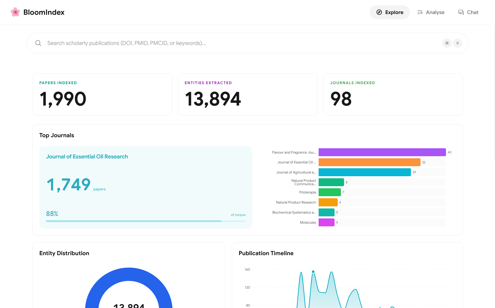
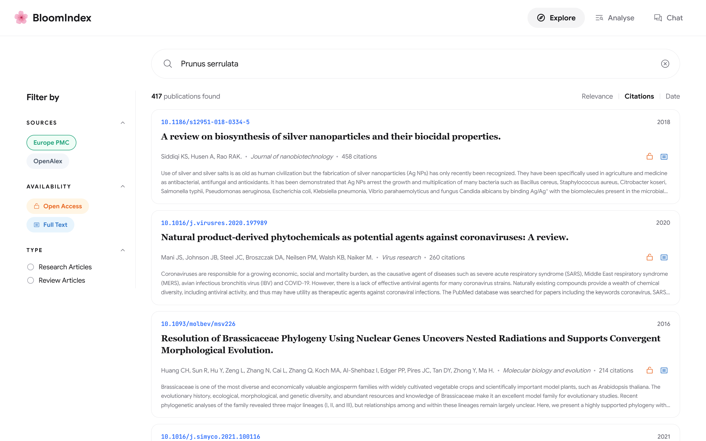
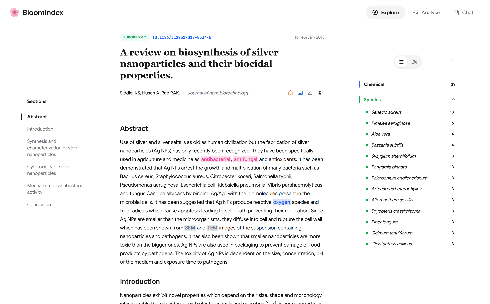
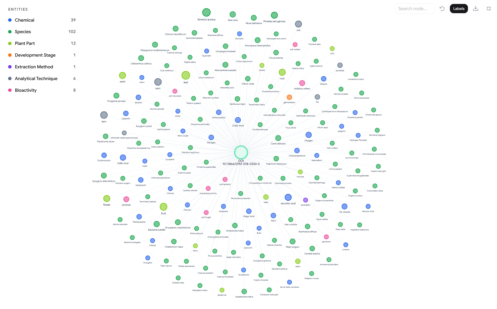
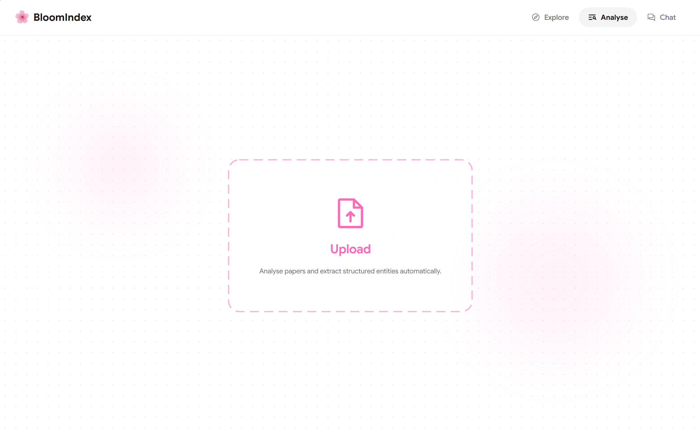
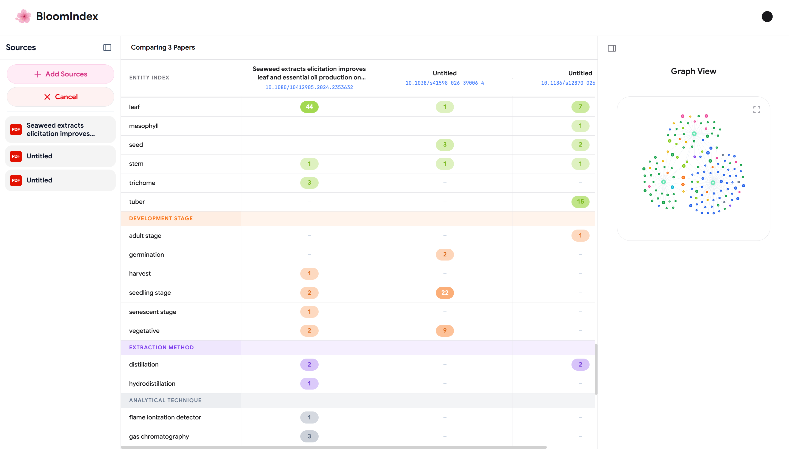
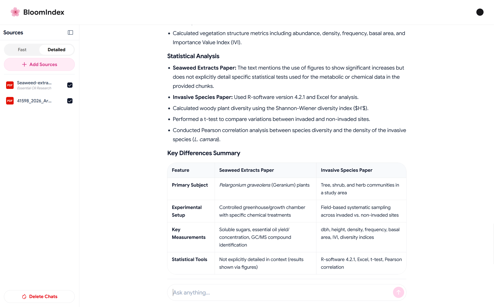
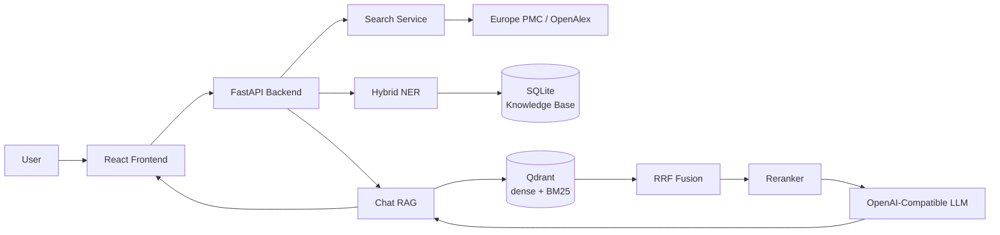
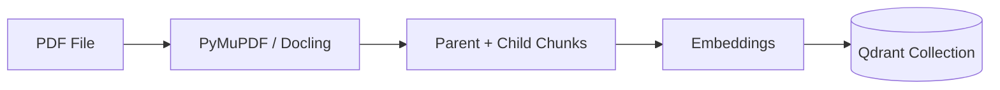

<div align="center">

  

  # BloomIndex

  **A search engine for phytochemistry literature**

  Explore · Analyse · Chat

  
  
  
  

</div>

BloomIndex helps researchers search the phytochemistry literature, extract entities, and build a local knowledge base. Users ask questions about uploaded PDFs and get answers that cite the source text.

---

## Table of Contents

* [🌟 Overview](#-overview)
* [📸 Screenshots](#-screenshots)
* [✨ Features](#-features)
* [🧭 Workspaces](#-workspaces)
* [🧬 Entity Extraction](#-entity-extraction)
* [🏗 Architecture](#-architecture)
* [📊 Evaluation](#-evaluation)
* [📚 Documentation](#-documentation)
* [🧰 Technology Stack](#-technology-stack)
* [🤖 OpenAI-Compatible LLM](#-openai-compatible-llm)
* [🚀 Quick Start](#-quick-start)
* [✅ Verify the Installation](#-verify-the-installation)
* [🔒 Data Privacy](#-data-privacy)

---

## 🌟 Overview

Phytochemistry literature grows faster than any researcher can read. Important facts stay hidden inside thousands of PDFs.

BloomIndex opens that literature in one local workspace. Search Europe PMC and OpenAlex from one box. Store the papers you need in a knowledge base. Extract phytochemistry-related entities from every full text. Then ask your questions. Every answer cites the passages that support it.

---

## 📸 Screenshots

### Dashboard



The dashboard shows indexed papers, extracted entities, and journal statistics.

### Literature Search



One search box covers Europe PMC and OpenAlex. Filters narrow the results by source, availability, and publication type.

### Paper Reader



The reader shows the full text with entity highlights. A side panel lists all entities by type.

### Knowledge Graph



The graph links one paper to its species, chemicals, methods, and bioactivities.

### Analyse



Upload a PDF. The dictionary pass runs first. The LLM pass adds context types.

### Comparison Matrix



The matrix compares entity counts across papers. Rows group by entity type.

### Chat



Chat answers questions from your PDFs. Each claim carries a citation to its source passage.

---

## ✨ Features

| Feature | Description |
|----------|-------------|
| Literature Search | Search Europe PMC and OpenAlex by keyword, DOI, PMID, or PMCID |
| Knowledge Base | Store papers in SQLite. Show dashboard statistics |
| PDF Upload | Upload papers. Extract entities from the full text |
| Hybrid NER | Eight dictionaries match first. An LLM pass adds context types |
| Comparison Matrix | Compare entity counts across two or more papers |
| Cited Chat | Hybrid retrieval finds passages. Answers cite their sources |
| Paper Reader | Read full text with section navigation and entity highlights |
| Knowledge Graph | Show the entities of one paper as a graph |

---

## 🧭 Workspaces

BloomIndex has four workspaces. Each workspace covers one step of the research flow.

| Workspace | Route | Description |
|-----------|-------|-------------|
| Explore | `/` | Search literature and view knowledge-base statistics |
| Analyse | `/analyse` | Upload PDFs, extract entities, and compare papers |
| Chat | `/chat` | Ask questions over uploaded PDFs and get cited answers |
| Paper | `/paper/<doi>` | Read full text with entity highlights and a knowledge graph |

---

## 🧬 Entity Extraction

Eight dictionaries with more than 300,000 terms run first. An LLM pass then adds the context types location and disease. A validation step with retries removes LLM errors. Set `NER_HYBRID=false` to run the dictionaries only, with no LLM cost.

| Entity Type | Example |
|-------------|---------|
| Chemical | quercetin |
| Species | *Prunus serrulata* |
| Plant Part | leaf |
| Season | spring |
| Development Stage | germination |
| Extraction Method | hydrodistillation |
| Analytical Technique | gas chromatography |
| Bioactivity | antioxidant |

Per-dictionary term counts and the gold-set breakdown appear in [EVAL_DATASET](docs/EVAL_DATASET.md).

---

## 🏗 Architecture



The code has four layers. Each layer communicates only with the layer below it.

```text
Frontend (React 19 + Vite)
    ↓ REST
Routers (FastAPI, HTTP only)
    ↓
Services (papers, search, ner, chat)
    ↓
Data (Qdrant, SQLite, LLM API)
```

### Document Ingestion

Papers must be processed before you can chat with them.



### Query Pipeline

Every chat question follows this path.

```text
Question
    ↓
Dense search + BM25 search
    ↓
RRF fusion
    ↓
Cross-encoder rerank
    ↓
Prompt + conversation history
    ↓
LLM
    ↓
Answer with [cN] citations
```

Routers handle HTTP only. Services hold the application logic. SQL runs in one repository module.

The full module map and pipeline details are in [ARCHITECTURE](docs/ARCHITECTURE.md).

---

## 📊 Evaluation

BloomIndex ships two evaluation harnesses in `backend/evals/`.

### NER Evaluation

The gold set has 165 documents and 4,084 entities. Each run compares three configurations: dictionary, LLM, and hybrid.

| Config | Micro F1 |
|--------|----------|
| Dictionary | 0.98 |
| LLM only | 0.74 |
| Hybrid | 0.84 |

Dictionaries give the best precision on the eight types they cover. The hybrid pass adds location and disease types, which the dictionaries do not cover.

### Chat Evaluation

The chat harness runs two tests: MCQ accuracy and open-ended scoring with RAGAS. RAGAS reports faithfulness, answer relevancy, answer correctness, context precision, and context recall.

The methodology, the reproduction steps, and the full stored numbers are in [EVALUATION](docs/EVALUATION.md), [EVAL_PIPELINE](docs/EVAL_PIPELINE.md), and [EVAL_RESULTS](docs/EVAL_RESULTS.md).

---

## 📚 Documentation

| Document | Description |
|-----------|-------------|
| [ARCHITECTURE](docs/ARCHITECTURE.md) | System architecture, layers, and pipelines |
| [API](docs/API.md) | REST endpoints, schemas, and streaming frames |
| [EVALUATION](docs/EVALUATION.md) | Evaluation frameworks, metrics, and limitations |
| [EVAL_DATASET](docs/EVAL_DATASET.md) | NER gold set and RAG question bank |
| [EVAL_PIPELINE](docs/EVAL_PIPELINE.md) | Reproduction steps for both harnesses |
| [EVAL_RESULTS](docs/EVAL_RESULTS.md) | Stored NER and RAGAS scores |

---

## 🧰 Technology Stack

### Backend

* FastAPI
* Uvicorn
* Qdrant
* LangChain
* spaCy
* Sentence Transformers
* PyMuPDF / Docling
* SQLite + SQLAlchemy

### Retrieval and Ranking

* bge-m3 dense embeddings
* BM25 sparse vectors
* Server-side RRF fusion
* Cross-encoder reranker

### Frontend

* React 19
* Vite
* TypeScript
* Tailwind CSS 4
* Zustand

---

## 🤖 OpenAI-Compatible LLM

BloomIndex connects to one OpenAI-compatible endpoint. You set the base URL, the key, and the model. You can switch providers without code changes. The endpoint can run in the cloud or on your machine.

---

## 🚀 Quick Start

Prerequisites:

* Python 3.12 or later
* [uv](https://docs.astral.sh/uv/) for dependency management (recommended)
* Node.js 18 or later
* Docker or Podman to run the Qdrant container

### 1. Clone Repository

```bash
git clone https://github.com/saifnama/BloomIndex
cd BloomIndex
```

### 2. Start Qdrant

```bash
./scripts/qdrant.sh start
```

Alternatively, start the container directly:

```bash
docker run -d --name bloomindex-qdrant -p 6333:6333 -p 6334:6334 qdrant/qdrant:v1.19.1
```

Qdrant Server accepts any number of API workers. Embedded mode (no `QDRANT_URL`) takes an exclusive lock and allows exactly one worker.

### 3. Backend Setup

```bash
uv sync
source .venv/bin/activate
python -m spacy download en_core_web_sm
cp .env.example .env
```

No uv? Use pip:

```bash
python -m venv .venv
source .venv/bin/activate
pip install -r backend/requirements.txt
```

Set these variables in `.env`:

```env
LLM_API_BASE_URL=https://openrouter.ai/api/v1
LLM_API_KEY=your_key
LLM_MODEL=your_model
```

Start the API:

```bash
uvicorn backend.src.main:app --port 8000
```

```text
Backend:       http://localhost:8000
API reference: http://localhost:8000/docs
```

Every endpoint is documented in [API](docs/API.md).

### 4. Frontend Setup

```bash
cd frontend
npm install
npm run dev
```

```text
Frontend: http://localhost:5173
```

Profiles: set `BLOOMINDEX_PROFILE=<name>` to load `.env.<name>` over the base `.env`. Real OS environment variables always take precedence.

---

## ✅ Verify the Installation

With the API running, check the health endpoint:

```bash
curl http://localhost:8000/health/ready
```

The endpoint reports `ready`, `degraded`, or `down`. `degraded` means one dependency, such as the LLM endpoint or Qdrant, is not reachable.

Then check the frontend production build:

```bash
cd frontend && npm run build
```

---

## 🔒 Data Privacy

BloomIndex keeps your research data on your machine. Papers, vectors, uploaded files, and the knowledge base stay local.

The LLM endpoint decides the one step that can send text out:

* **Local** (llama.cpp, Ollama, vLLM): All processing runs on your machine. No text leaves it.
* **Cloud**: The question and the retrieved passages go to the provider. Your files stay local.
