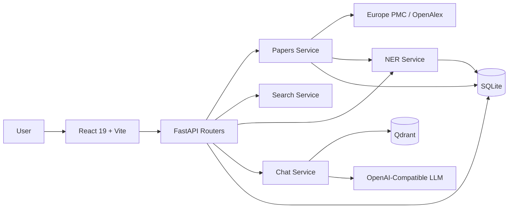
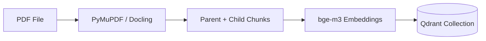
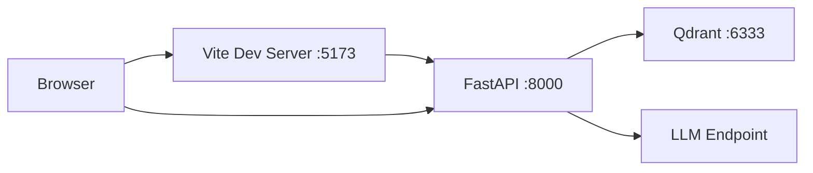

# System Architecture

This document describes the architecture of BloomIndex and the flow of data from paper search to cited answers.

---

# Overview

BloomIndex is a search engine for phytochemistry literature. It searches external databases, extracts entities, stores papers in a local knowledge base, and answers questions with citations.

The architecture has layers for:

* User interaction
* Request handling
* Literature search
* Entity extraction
* Retrieval and answer generation
* Data storage

---

# Architectural Principles

* Retrieval before generation
* Thin routers that hold only HTTP code
* All SQL in one repository module
* Dictionary-first NER. The LLM only assists.
* One OpenAI-compatible LLM client for every feature
* Local-first data in Qdrant and SQLite
* Honest health reporting

---

# High-Level Architecture



---

# Frontend Architecture

The frontend uses React 19, Vite, TypeScript, Tailwind CSS 4, and Zustand.

```text
frontend/src/
    routes/            file-based routes (TanStack Router)
    pages/             explore, analyse, chat, paper
    features/          search, reader (with the knowledge graph), papers, chat
    components/ui/     shared primitives
    lib/api/           one client module per backend area
    stores/            Zustand stores
```

The frontend communicates with the backend over REST. Chat answers stream as NDJSON frames.

---

# Backend Architecture

The backend uses FastAPI and follows a layered design:

```text
Routers
    ↓
Services
    ↓
Repository and data stores
```

## Code Layout

```text
backend/src/
    main.py settings.py dependencies.py exceptions.py middleware.py
    routers/    paper.py search.py ner.py rag.py dashboard.py doi.py health.py
    domain/     Pydantic models (no SQL, no HTTP)
    common/     paths, caching, session, uploads, secrets, sanitizer, highlighter, http_client, llm_client
    db/         session, models, repository (all SQL), migrations
    papers/     service, resolver, europe_pmc/, openalex/
    search/     service
    ner/        service, dictionary, llm, dictionaries/
    chat/       service, ingest, retrieval, citations, embeddings, llm, config, ai/
```

## Routers

Routers expose HTTP endpoints and validate input. They hold no SQL and no business logic. `routers/rag.py` owns the chat routes, including the NDJSON stream.

## Services

Services hold the application logic:

* `papers/service.py` - fetches, parses, and highlights papers
* `search/service.py` - queries Europe PMC and OpenAlex
* `ner/service.py` - runs the extraction pipeline
* `chat/service.py` - runs retrieval and answer generation

The dashboard router reads its statistics directly from the repository. It has no service module.

## Repository

`db/repository.py` holds every SQL statement. Routers and services call it. Nothing else touches SQLite.

---

# Document Ingestion Pipeline

Papers must be processed before chat can use them.



* Chat uploads index into per-user collections. These collections are temporary.
* `scripts/ingest_kb.py` indexes the permanent `kb_papers` collection and fills the SQLite knowledge base.
* The parser is configurable. PyMuPDF and Docling are both supported.

---

# Query Processing Pipeline

Every chat question follows this path:

```text
Question
    ↓
Router
    ↓
Chat service
    ↓
Dense search + BM25 search
    ↓
RRF fusion
    ↓
Cross-encoder rerank
    ↓
Prompt + conversation history
    ↓
LLM
    ↓
Streaming answer with [cN] citations
```

Retrieval runs dense and sparse searches in parallel. Server-side RRF fuses the results. A cross-encoder reranks the fused list. Citations resolve against whole parent chunks.

---

# NER Layer

Extraction runs in two passes:

1. Eight dictionary matchers scan the text with PhraseMatcher. The dictionaries hold more than 300,000 terms and run in about one millisecond per abstract.
2. An LLM pass adds the context types LOCATION and DISEASE. The prompt excludes the five structural types: plant part, analytical technique, extraction method, development stage, and season. The LLM also re-checks chemicals, species, and bioactivities.

A fusion step merges spans, deduplicates, and normalizes names. A verbatim filter rejects entities that do not appear in the source text. `NER_HYBRID=false` disables the LLM pass and runs the dictionaries only.

---

# Search Layer

`papers/` owns the external connectors:

* `europe_pmc/` - Europe PMC client, service, and JATS parser
* `openalex/` - OpenAlex client and service
* `resolver.py` - DOI resolution

Search results merge both sources. Availability and type filters map to each source's native parameters.

---

# LLM Layer

All features share one OpenAI-compatible client configured by `LLM_API_BASE_URL`, `LLM_API_KEY`, and `LLM_MODEL`. Supported endpoints include OpenRouter, OpenAI, Ollama, and vLLM. You can switch providers without code changes.

`chat/ai/health.py` calls the endpoint's `/models` route for the readiness probe. Results cache for 60 seconds. The probe is non-billable.

---

# Source Attribution

Answers carry `[cN]` markers. The sources frame maps each marker to a retrieved passage with its file and location. The frontend lets the user click a marker to see the passage. This keeps every answer checkable against the source text.

---

# Streaming

`/api/chat/query/stream` returns `application/x-ndjson`. Each line is one JSON frame:

| Frame | Purpose |
|-------|---------|
| `sources` | Citation sources, sent first |
| `text_delta` | One answer chunk |
| `answer_corrected` | Final answer text |
| `error` | Failure message |
| `done` | End of stream |

The frontend renders chunks as they arrive, so the answer grows in place.

---

# Deployment Architecture



Two run modes exist:

* Development - Vite serves the UI on 5173 and proxies API routes to 8000.
* Production - `npm run build` produces `frontend/dist`, and FastAPI serves it on 8000.

Qdrant runs as a container through `scripts/qdrant.sh`. Without `QDRANT_URL`, the app uses embedded mode, which allows exactly one worker.

---

# Configuration

Environment variables configure everything. The variable groups are LLM, Qdrant, RAG, and NER. `BLOOMINDEX_PROFILE` selects `.env.<profile>` over the base `.env`.

---

# Design Goals

* Every answer stays checkable against its source
* Dictionaries give speed and precision. The LLM adds coverage.
* One LLM client, one repository, one router per area
* All research data stays on the user's machine
