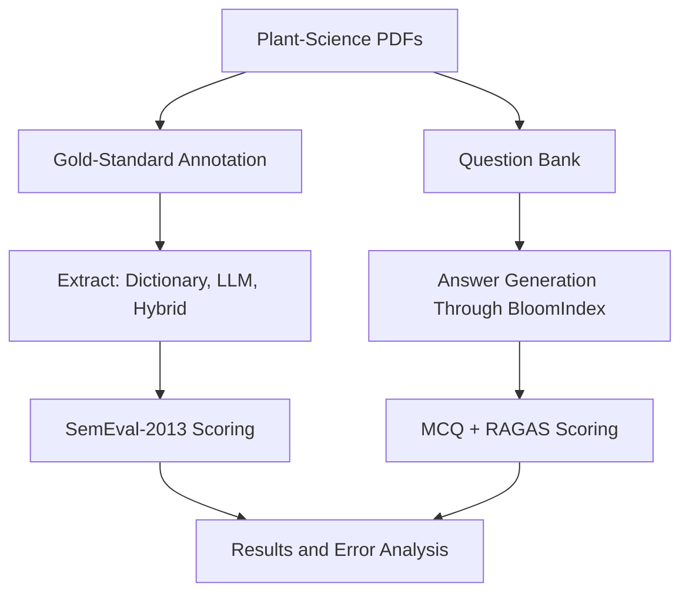

# Evaluation Pipeline

This document explains how to reproduce the BloomIndex evaluation workflow.

The pipeline covers both harnesses: NER extraction scoring and RAG answer scoring.

---

# Pipeline Overview



---

# Directory Structure

```text
backend/evals/

    ner/
        extract.py            run the three extraction configurations
        evaluate.py           score against the gold standard
        fp_fn_export.py       export false positives and negatives
        data/                 gold set + prediction files
        results/              score CSVs

    rag/
        rag_mcq.py            run RAG on MCQ questions
        rag_open_ended.py     run RAG on open-ended questions
        eval_mcq.py           score MCQ answers
        eval_open_ended.py    score open-ended answers with RAGAS
        data/                 question banks
        results/              answer and score CSVs
```

---

# NER Pipeline

## Stage 1 - Extract Predictions

Run all three extraction configurations against the gold texts:

```bash
python backend/evals/ner/extract.py
```

Flags:

```bash
python backend/evals/ner/extract.py --skip-llm   # dictionary + hybrid only
python backend/evals/ner/extract.py --llm-only   # re-run the LLM pass
```

Outputs: `data/dictionary.json`, `data/llm.json`, `data/hybrid.json`.

## Stage 2 - Score

```bash
python backend/evals/ner/evaluate.py
```

The script computes SemEval-2013 strict and partial scores with `nervaluate`. Outputs: `results/results.csv` and `results/results_per_type.csv`.

## Stage 3 - Error Analysis

```bash
python backend/evals/ner/fp_fn_export.py
```

Exports false positives and false negatives per config for manual review. The error categories appear in [Evaluation Results](EVAL_RESULTS.md).

---

# RAG Pipeline

## Stage 1 - Index the Corpus

Place PDFs in `knowledge_base/papers/`, then run:

```bash
python scripts/ingest_kb.py
```

The script parses the PDFs, chunks them, embeds them, and stores them in the `kb_papers` Qdrant collection.

## Stage 2 - Prepare Questions

Question banks live in `backend/evals/rag/data/`:

* `mcq.csv` - `id, question, option_a..option_d, correct_option, difficulty`
* `open_ended.csv` - `id, question, reference, difficulty`

Convert a JSON question set with:

```bash
python scripts/json_to_csv.py your_questions.json
```

## Stage 3 - Generate RAG Answers

Run the questions through the real RAG pipeline:

```bash
python backend/evals/rag/rag_mcq.py
python backend/evals/rag/rag_open_ended.py
```

Outputs: `results/rag_outputs_mcq.csv` and `results/rag_outputs_open_ended.csv`. Each row stores the generated answer, retrieved contexts, retrieved sources, and similarity scores. The scripts save checkpoints as they run. A re-run continues where the last run stopped.

## Stage 4 - Score the Answers

```bash
python backend/evals/rag/eval_mcq.py
python backend/evals/rag/eval_open_ended.py
```

`eval_mcq.py` parses the predicted option and computes overall and per-difficulty accuracy. `eval_open_ended.py` computes five RAGAS metrics and prints the averages.

Outputs: `results/mcq_eval_results.csv` and `results/open_ended_eval_results.csv`.

---

# Configuration

All settings use environment variables. The RAGAS judge and the LLM extraction pass share the application's `LLM_API_*` client.

| Env Var | Default | Purpose |
|---------|---------|---------|
| `EVAL_OUTPUT_DIR` | `backend/evals/rag/results` | Output directory for CSVs |
| `EVAL_MCQ_CSV` | `backend/evals/rag/data/mcq.csv` | MCQ input |
| `EVAL_OPEN_ENDED_CSV` | `backend/evals/rag/data/open_ended.csv` | Open-ended input |
| `RAGAS_EMBEDDING_MODEL` | `BAAI/bge-small-en-v1.5` | RAGAS embeddings |
| `METRIC_MAX_RETRIES` | `3` | RAGAS retry count |
| `METRIC_BASE_DELAY` | `30` | RAGAS retry delay in seconds |

---

# Running the Full Pipeline

```bash
# NER
python backend/evals/ner/extract.py
python backend/evals/ner/evaluate.py
python backend/evals/ner/fp_fn_export.py

# RAG
python scripts/ingest_kb.py
python backend/evals/rag/rag_mcq.py
python backend/evals/rag/rag_open_ended.py
python backend/evals/rag/eval_mcq.py
python backend/evals/rag/eval_open_ended.py
```

The RAG stages need a running Qdrant and a configured `.env` (`LLM_API_BASE_URL`, `LLM_API_KEY`, `LLM_MODEL`). The scoring scripts also need `ragas` and `nervaluate`. Install them with:

```bash
pip install -r backend/requirements-evals.txt
```

---

# Reproducibility

The RAG evaluation reuses the production pipeline: the same Qdrant collections, hybrid retrieval, reranker, prompts, and LLM client serve both chat users and the evaluation. Results therefore reflect real application behavior.

`ragas` and `nervaluate` are pinned in `backend/requirements-evals.txt`. They stay out of the main requirements to avoid a dependency conflict.
